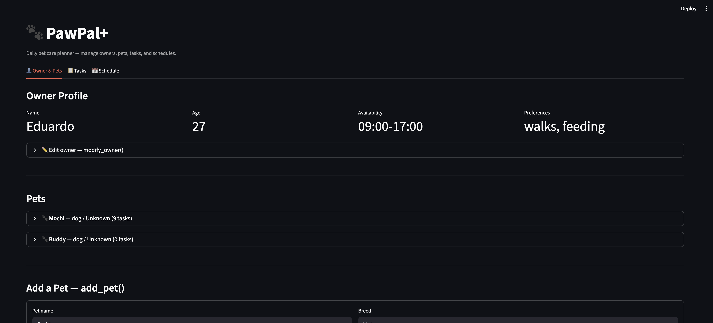

# PawPal+

**PawPal+** is a Streamlit-based pet care scheduling assistant that helps busy owners stay consistent with daily pet care. The app manages owner profiles, pet records, and care tasks, then automatically builds an optimized daily schedule — and explains every decision it makes.

---

## Getting started

### Setup

```bash
python -m venv .venv
source .venv/bin/activate  # Windows: .venv\Scripts\activate
pip install -r requirements.txt
```

### Run the app

```bash
streamlit run app.py
```

---

## Architecture

The system is built around five classes in `pawpal_system.py`:

| Class | Responsibility |
|---|---|
| `Owner` | Profile, availability window, pet and task lists |
| `Pet` | Species, breed, and associated task list |
| `Task` | Description, priority, duration, frequency, scheduled times |
| `Scheduler` | Daily plan for one owner: sorted tasks + explanation log |
| `PawPalSystem` | Central registry; coordinates all CRUD and scheduling operations |

---

## Features

### Greedy Priority Scheduling — `PawPalSystem.create_plan`
Generates a conflict-free daily plan in three steps:
1. Collect all tasks assigned to the owner's pets on the target date.
2. Sort tasks in descending order of **effective priority** — a base level (`low=1`, `medium=2`, `high=3`) boosted by `+1` when the task description matches the owner's stated preferences.
3. Walk the sorted list and assign each task sequentially to the next available slot within the owner's availability window (`HH:MM–HH:MM`). Tasks that no longer fit are excluded and logged with an explanation.

This guarantees the most important tasks are always placed first and nothing falls through the gaps due to silent omission.

### Chronological Sorting — `Scheduler.sort_by_time`, `Scheduler.view_plan`
Sorts tasks by `scheduled_start_time` using Python's `sorted()` with a `lambda` key. Because start times are stored as `datetime.time` objects, the comparison is numeric — there is no lexicographic ordering bug (e.g., `"9:00" > "10:00"` as raw strings). Tasks without a scheduled start time are appended at the end rather than interleaved, so the displayed plan always flows top-to-bottom in a sensible order.

### Interval-Overlap Conflict Detection — `Scheduler.detect_conflicts`, `Scheduler.get_conflict_warnings`
Scans all scheduled tasks using the standard interval-overlap test:

```
overlap = start1 < end2  AND  end1 > start2
```

Runs in O(n²) over scheduled tasks on the same date — acceptable for typical daily schedules (< 20 tasks). Each conflicting pair is classified into one of two categories and returned as a human-readable warning:

- **same-pet conflict** — both tasks are assigned to the same pet; the pet would need to perform two activities simultaneously.

- **cross-pet conflict** — tasks belong to different pets; the owner cannot physically attend to both at once.

Returns warnings rather than raising exceptions so the app stays usable even when the schedule has problems.

### Automatic Recurrence — `PawPalSystem.complete_task`, `PawPalSystem.generate_recurring_tasks`
When a `daily` or `weekly` task is marked complete, the system immediately creates and registers the next occurrence:

- `complete_task(task_id)` — marks the task done and creates exactly one follow-up task shifted by `timedelta(days=1)` or `timedelta(weeks=1)`. One-time (`once`) tasks produce no follow-up.
- `generate_recurring_tasks(template, end_date)` — bulk-generates all occurrences of a task from the day after the template up to and including `end_date`, registering each via `add_task()` so it is immediately linked to the correct owner and pet.

Month and year boundaries (e.g., January 31 → February 1) are handled automatically by Python's `timedelta` arithmetic.

### Task Filtering — `PawPalSystem.filter_tasks`
Filters the full task catalogue by pet name, completion status, or both combined:

- Pet name matching is **case-insensitive**: `"luna"` matches `"Luna"`.
- Resolves pet names to `pet_id` values first so the per-task comparison is an O(1) set lookup rather than a repeated string scan.
- Passing `None` for either parameter skips that filter, making the method fully composable.
- Returns an empty list for unrecognised pet names rather than raising an error.

### Schedule Validation — `Scheduler.validate_schedule`, `Scheduler.add_task`
Before adding any task to a plan, `validate_schedule` re-runs the interval-overlap check against the existing task list. `add_task` calls this guard automatically and logs the outcome — either the inclusion reason or an exclusion note — to the plan's explanation log, so the audit trail is always complete.

---

## Testing PawPal+

Run the full test suite from the project root:

```bash
python -m pytest tests/test_pawpal.py -v
```

The tests cover four areas of the scheduling system:

**Sorting correctness** — verifies that tasks are always returned in chronological order regardless of insertion order, including tasks from multiple pets interleaved by time and unscheduled tasks appended last.

**Recurrence logic** — confirms that completing a `daily` task creates exactly one new task for the following day, that the next occurrence starts as pending, and that month/year boundary rollovers (e.g. Jan 31 → Feb 1) are handled correctly. Also verifies that `once` tasks produce no follow-up.

**Conflict detection** — verifies that the `Scheduler` flags overlapping tasks including exact duplicate start times, partial overlaps, and three-way overlaps, while correctly leaving sequential tasks (touching endpoints) clear. Checks that warning messages are labelled `same-pet` or `cross-pet` as appropriate.

**Filtering** — verifies that tasks can be filtered by pet name (case-insensitive), completion status, or both combined, and that the system returns an empty list for unknown pet names rather than raising an error.

## 📸 Demo


